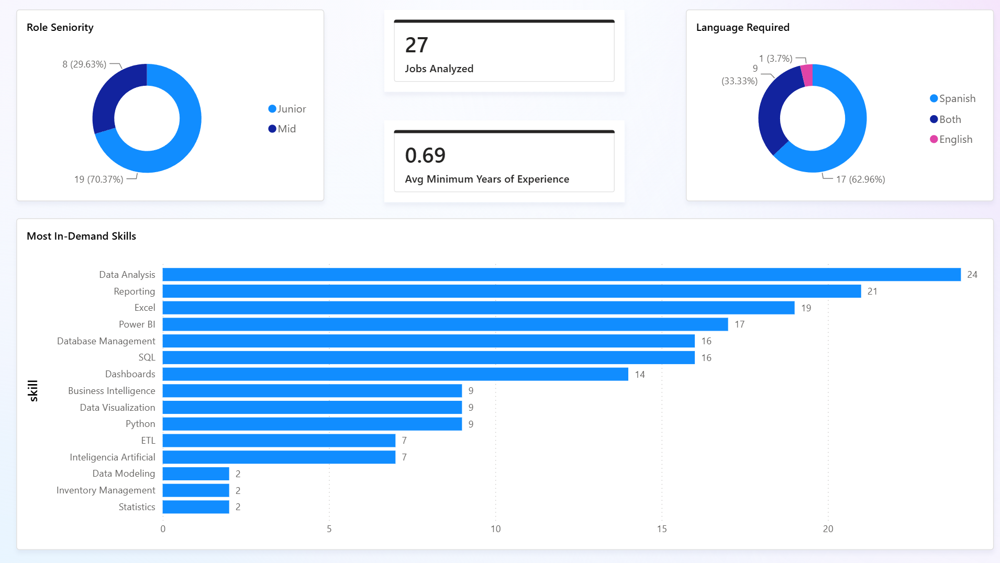

# AI-Powered Job Market Analyzer — Data Analyst Roles
 Overview
An AI-powered pipeline that automatically extracts and analyzes 
structured insights from job postings using the Claude API. 
Analyzes required skills, seniority levels, and language 
requirements for data analyst roles in Mexico City.

## Tools Used
- Python / pandas
- Claude API (Anthropic)
- Power BI

## How It Works
1. Raw job posting text collected from LinkedIn and OCC Mundial
2. Each posting sent to Claude API for structured data extraction
3. Claude automatically standardizes skill names during extraction
   (e.g. "Excel Avanzado" → "Excel", "DAX" → "Power BI")
4. Claude uses its own judgment to group any skills not explicitly
   listed — making the pipeline scalable without manual updates
5. Results stored in pandas DataFrame with a unique job_id per posting
6. Skills exploded into individual rows for granular analysis
7. Both tables linked in Power BI via job_id for cross-filtering

## Design Decisions
- **Prompt-based standardization over manual mapping**: Initially
  used a hardcoded skill_mapping dictionary to clean skill names.
  Replaced this with Claude's own judgment inside the prompt —
  meaning any new job postings added in the future are automatically
  standardized without touching the code.
- **job_id as a bridge**: Added a unique job_id to both tables so
  Power BI visuals filter each other when clicking on any data point.


## Dashboard Preview


## Files
- `job_market_analyzer.ipynb` — full pipeline notebook
- `jobs_analysis.csv` — one row per job posting
- `skills_analysis.csv` — one row per skill mention
## Claude API Prompt
The following prompt was used to extract structured data from each job posting:

```
Extract the following from this job posting and return ONLY a JSON object, no extra text:

- job_title (string)
- company (string, use "Unknown" if not found)
- required_skills (list of strings, standardize ALL skill names using these rules:
    - Use "Excel" for: Excel Avanzado, Microsoft Excel, Google Sheets, VLOOKUP, Tablas dinamicas, PowerPoint, Microsoft Office, Office
    - Use "Power BI" for: DAX, Power Query, Dataflow, Dataset, Power BI/DAX
    - Use "SQL" for: SQL Avanzado
    - Use "Data Analysis" for: Análisis de datos, Data Analytics, Pensamiento analitico, Analytical Skills
    - Use "Reporting" for: Reportes, Reportes ejecutivos, Elaboracion de reportes, informes
    - Use "Dashboards" for: Dashboard Design, Dashboard Development, Tableros de control
    - Use "Database Management" for: Bases de datos, Administracion de bases de datos, Gestion de bases de datos
    - Use "Business Intelligence" for: Herramientas de BI, BI Tools
    - Use "Inteligencia Artificial" for: AI, Artificial Intelligence, AI Tools, ChatGPT, Copilot, Gemini
    - Use "ETL" for: ETL/ELT
    - Use "Data Visualization" for: Visualizacion de datos
    - Use your own judgment to group any other similar or equivalent skills not listed above 
      into their most appropriate standardized category. Prioritize consistency over specificity.)
- experience_years_min (number, use 0 if not found)
- experience_years_max (number, use 0 if not found)
- seniority (string: "Junior", "Mid", or "Senior")
- language_required (string: "Spanish", "English", or "Both")

Job posting:
{job_text}
```


## How to Run
1. Clone this repository
2. Install dependencies: `pip install requests pandas`
3. Get a Claude API key from console.anthropic.com
4. Replace `YOUR_API_KEY_HERE` in the notebook with your key
5. Add job posting texts to the `job_postings` list
6. Run all cells in order
7. Load the exported CSVs into Power BI
