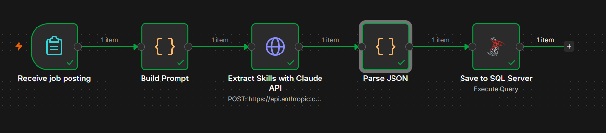

# Job Posting Automation (n8n)

An n8n workflow that turns a pasted job posting into structured data in SQL Server, feeding a Power BI dashboard.

## How it works
1. **Receive job posting**: a web form receives the job posting.
2. **Build Prompt**: builds the prompt with skill standardization rules.
3. **Extract Skills with Claude API**: sends it to the Claude API (temperature 0) and receives JSON.
4. **Parse JSON**: cleans and parses the response.
5. **Save to SQL Server**: inserts the job into `jobs` and splits its skills into `job_skills`.

Power BI reads from SQL Server, so new postings appear on refresh.

## Stack
n8n (self-hosted with Docker), Claude API, JavaScript, SQL Server, Power BI

## Setup
Import `workflow.json` into n8n and add two credentials: Header Auth (`x-api-key`) for the Claude API, and Microsoft SQL for the database.
